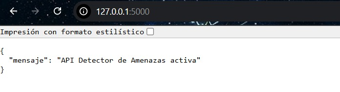
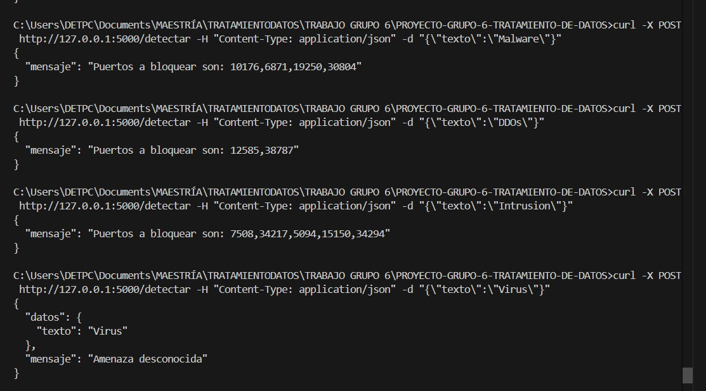

# PROYECTO DE TRATAMIENTO DE DATOS GRUPO 6

## Objetivo
Analizar el impacto en redes de las amenazas más importantes para una red WAN.

## Procedimiento
Se eligió un dataset con valores de ataques grandes a redes detectadas hasta el 2023. Esto es importante ya que nos permite tener una idea del comportamiento de los atacantes y la manera en que tratan de alcanzar las redes y causar afectaciones importantes.

Las tres principales amenazas encontradas son:

### Malware
- **Definición:** Software malicioso diseñado para dañar, infiltrar o tomar el control de sistemas informáticos sin el consentimiento del usuario.  
- **Ejemplos:** Virus, troyanos, ransomware, spyware.  
- **Objetivo:** Robar información, causar daños, espiar o controlar dispositivos.

### DDoS (Distributed Denial of Service)
- **Definición:** Ataque en el que múltiples sistemas comprometidos envían un gran volumen de tráfico o solicitudes a un servidor o red, con el objetivo de saturarlo y dejarlo fuera de servicio.  
- **Características:** Distribuido (varias fuentes), provoca indisponibilidad de servicios.  
- **Objetivo:** Interrumpir el funcionamiento normal de una página web, servidor o red.

### Intrusión
- **Definición:** Acceso no autorizado a un sistema o red con el fin de obtener información, causar daños o manipular datos.  
- **Tipos:** Intrusión física o cibernética.  
- **Objetivo:** Romper la seguridad para explotar vulnerabilidades.

## Herramientas de Análisis
Existen un sin número de aplicaciones de análisis de tráfico entre la más conocida tenemos a **Wireshark** que nos puede entregar una gran cantidad de información en formato CSV.

Esa información puede presentarse con una gran cantidad de datos y lo importante es detectar qué información es relevante, y eso forma parte de un tratamiento de datos importante.

En nuestro caso el archivo que tomamos es entregado por una herramienta de análisis. Dentro del proceso, al contar con 25 columnas se nos complica el análisis.

1. En primera parte se empezó eliminando las columnas con valores nulos y después continuar con columnas con información que no es relevante al momento de buscar una forma de mitigar dichos ataques.
2. La segunda parte fue analizar los valores más relevantes como los tipos de ataques y relacionarlos con los tipos de protocolo con el tráfico que se utilizó durante el ataque debido a que esto nos permite buscar patrones de cómo los atacantes tratan de vulnerar las seguridades.
3. La tercera parte fue identificar los puertos en el destino donde el atacante trató de ingresar a nuestra red. El puerto de origen no es relevante; ya que es mucho más fácil el bloqueo de nuestros puertos. Todo esto se encuentra especificado en el código implementado en el repositorio.

## Aplicación de resultados
Un ejemplo que se implementó como un pequeño ejemplo es generar una API que al momento de colocar el tipo de ataque al usuario, la idea es que muestre qué puertos son los más comunes para cerrar ya que son los más utilizados por los atacantes. Esta idea sería una base para generar un código más potente que, al momento de detectar una amenaza, pueda cerrar de forma automática los puertos e identificar el tipo de ataque.
- **Pantalla de inicio de API**

- **RESULTADO DEL POST CON DIFERENTES AMENAZAS**

## Conclusiones
En el ámbito de la ciberseguridad en redes de telecomunicaciones, el tratamiento de datos es muy importante. Debido a la velocidad en la que las interacciones se producen, estas generan una cantidad enorme de datos en los cuales es complicado detectar algún patrón.

Las formas gráficas de ver los datos es una manera simplificada para su interpretación. En nuestro caso nos ayudó para poder determinar el enfoque de nuestro análisis y de esa manera poder gestionar una idea de solución al problema presentado.